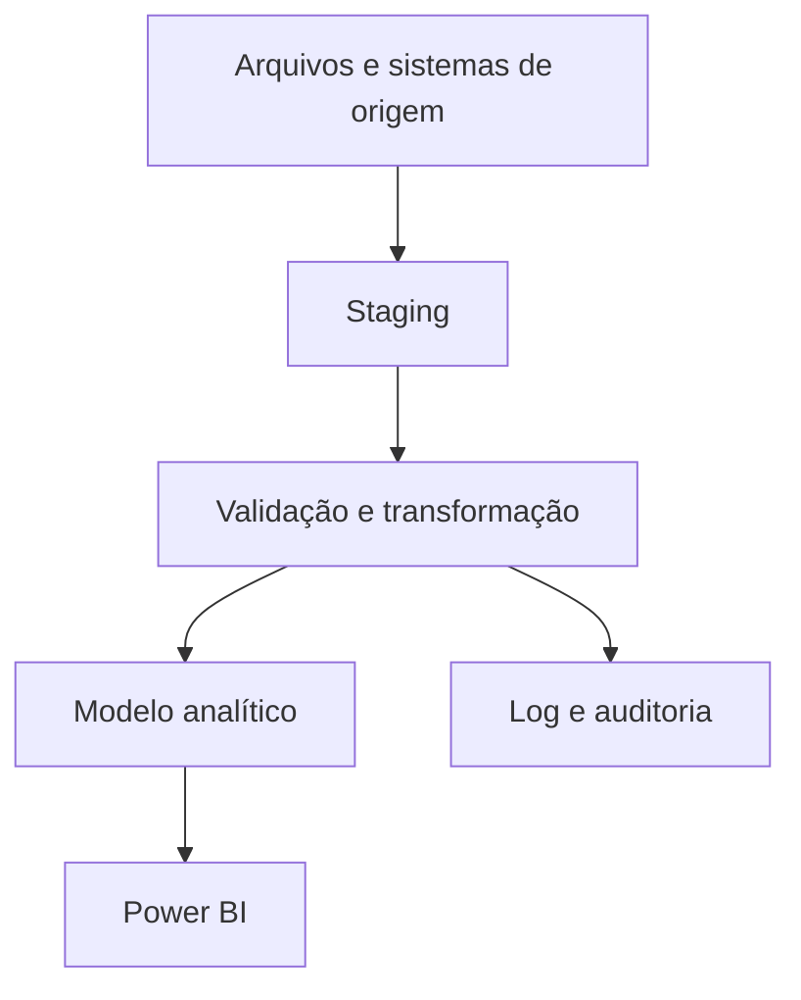

# Arquitetura de referência

## Fluxo

1. A origem é carregada uma única vez em staging.
2. Validações impedem que períodos vazios ou inconsistentes alterem o destino.
3. Transformações usam listas explícitas de colunas e conversões controladas.
4. A carga final ocorre dentro de uma transação.
5. Cada execução registra status, etapa, duração, período e quantidade de linhas.
6. O Power BI consome o modelo analítico, não os arquivos operacionais diretamente.
